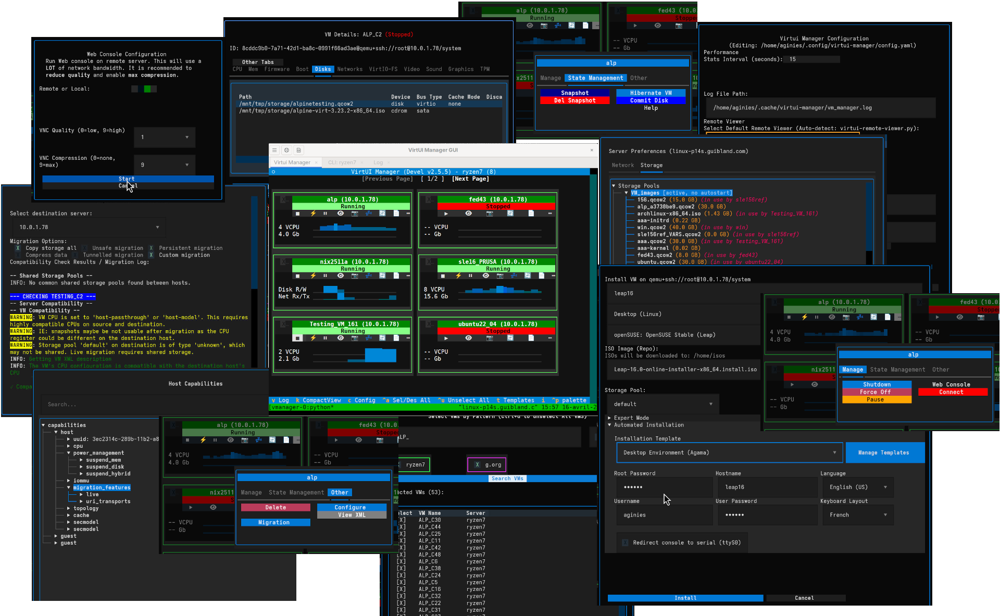

# VirtUI Manager

[Project Website](https://aginies.github.io/virtui-manager/)

A powerful, text-based Terminal User Interface (TUI) application for managing QEMU/KVM virtual machines using the libvirt Python API. 



## Why VirtUI Manager?

Managing virtual machines in a terminal environment has never been easier or more powerful. **VirtUI Manager** bridges the gap between the simplicity of command-line tools and the rich functionality of GUI-based solutions, offering the best of both worlds for virtualization administrators.

### The Problem with Traditional Tools

- **Virt-manager** requires X11 forwarding, which is slow, resource-intensive, and often impossible in remote environments
- **GUI-based solutions** are heavy with X dependencies, making them unsuitable for headless servers or low-bandwidth connections
- **Command-line tools** lack the intuitive interface needed for complex VM management tasks
- **Cockpit Machine** is feature incomplete, and needs a lot of depencies. It is not multi hypervisor oriented
- **Complex Deployment** no tools to easily manage auto-installation of Virtual Machine with registration process

### Why VirtUI Manager is Different

VirtUI Manager solves these challenges with:
- **Lightweight Terminal Interface**: No X11 dependencies, works perfectly over SSH
- **Remote Management**: Efficient low-bandwidth control of remote libvirt servers
- **Rich Feature Set**: Advanced VM management capabilities in a simple, intuitive interface
- **Multi-server Support**: Manage VMs across multiple libvirt servers from a single interface
- **Performance Optimized**: Built-in caching reduces libvirt calls and improves responsiveness (include a tracking resources call tool)
- **Libvirt Event handler**: Only get update on event from libvirt
- **Migration Support**: Live and offline VM migration capabilities and custom migration
- **Bulk Operations**: Execute commands across multiple VMs at once (including configuration)
- **Web Console Access**: Integrated VNC support with novnc over ssh tunnel for remote server
- **CMD line interface**: improved command line to manage VMs: multi hypervisors, VMs selection, clone operation, bulk command, install VM, etc...
- **Auto Installation**: Support auto installation for Debian, Ubuntu, Fedora, Archlinux, Alpine, OpenSUSE and SLES (with SCC registration)

## Documentation

[VirtUI Manager doc](https://aginies.github.io/virtui-manager/manual/)

## CI check

[](https://github.com/aginies/virtui-manager/actions/workflows/ci.yml)

## Flatpak build

[](https://github.com/aginies/virtui-manager/actions/workflows/flatpak.yml)

## Requirements

- **Recommended Minimal Terminal Size**: 34x92. **34x128** is the recommended Size
- **Remote Connection**: SSH access to libvirt server (ssh-agent recommended)
- **Python 3.7+**
- **libvirt** with Python bindings
- **Python Dependencies**: see requirements.txt file
- **Optional**: virt-viewer, novnc, websockify for enhanced functionality
- **Tmux**: To edit file with pseudo terminal

### Note about Libvirt API

As there is no simple way to get **sound** and **network** model using libvirt API, the user can provides a list in his own configuration file. 

To get a list of model for a machine type you can use the **qemu** command line:
```bash
qemu-system-x86_64 -machine pc-q35-10.1 -audio  model=help
qemu-system-x86_64 -machine pc-q35-10.1 -net  model=help
```

Possible User config parameters:
- **network_models**: List of allowed network models (default: `['virtio', 'e1000', 'e1000e', 'rtl8139', 'ne2k_pci', 'pcnet']`)
- **sound_models**: List of allowed sound models (default: `['none', 'ich6', 'ich9', 'ac97', 'sb16', 'usb']`)

## Contributing

[CONTRIBUTING.md](CONTRIBUTING.md)

## AI Assist

AI assistance is used to improve coding efficiency by automating boilerplate, suggesting relevant code completions, quickly detecting bugs, update the documentation, write test cases.

## License

This project is licensed under the GPLv3 License.
