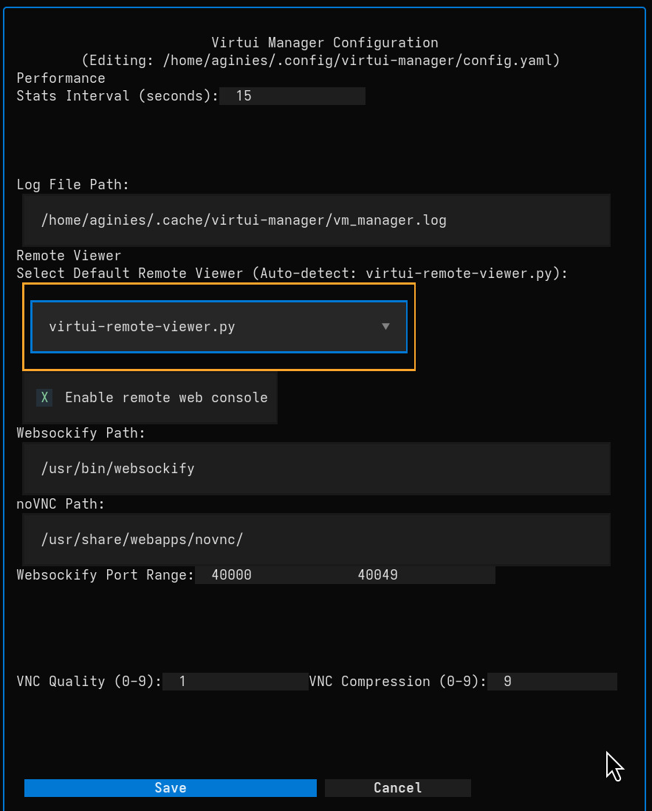

# App Configuration

Virtui Manager allows you to customize various aspects of its behavior, including performance settings, logging, and remote viewer integration.

To access the configuration, press **`c`** on your keyboard while in the main window.



## Configuration File

While most settings can be managed via the UI, Virtui Manager stores its configuration in a human-readable YAML file.

*   **Location:** `~/.config/virtui-manager/config.yaml`
*   **Format:** YAML

If the file does not exist, Virtui Manager will create it with default values upon the first launch or when you save settings from the UI.


### Example Configuration

```yaml
# Performance and UI
STATS_INTERVAL: 30
REMOTE_VIEWER: virtui-remote-viewer.py

# Logging
LOG_FILE_PATH: /home/user/.cache/virtui-manager/vm_manager.log

# Servers List
servers:
- name: Localhost
  uri: qemu:///system
- name: Production Host
  uri: qemu+ssh://admin@10.0.0.10/system

# Web Console (noVNC)
REMOTE_WEBCONSOLE: true
websockify_path: /usr/bin/websockify
novnc_path: /usr/share/novnc/
WC_PORT_RANGE_START: 40000
WC_PORT_RANGE_END: 40050
VNC_QUALITY: 0
VNC_COMPRESSION: 9
```

### Key Fields Explained

*   **`servers`**: A list of Libvirt connections. Each entry requires a `name` (for display) and a `uri` (the Libvirt connection string).
*   **`network_models` / `sound_models`**: These lists define the options available in the dropdown menus when provisioning new VMs. You can add custom models here if your environment requires them.
*   **`ISO_DOWNLOAD_PATH`**: The directory where downloaded ISO images are stored.
*   **`custom_ISO_repo`**: A list of paths to local directories containing ISO files that you want to be available during VM installation.

## Performance

*   **Stats Interval (seconds):**
    *   Determines how frequently the application updates VM status and statistics (CPU, Memory, I/O).
    *   **Default:** `5` seconds.
    *   **Tip:** Increasing this value can reduce the load on the host system, while decreasing it provides more real-time updates.

## Logging

*   **Log File Path:**
    *   The full path where the application writes its log file.
    *   Useful for troubleshooting issues.

## Remote Viewer

This section controls how the graphical console of VMs is accessed.

*   **Select Default Remote Viewer:**
    *   Choose the application used to view the VM's display.
    *   **Options:**
        *   `virtui-remote-viewer.py`: The built-in viewer (recommended).
        *   `virt-viewer`: The standard external viewer.
    *   If set to **Auto-detect**, the application will attempt to find an available viewer.

## Web Console (noVNC)

These settings configure the built-in web-based remote console capabilities, useful for headless server environments or accessing VMs via a browser.

*   **Enable remote web console:**
    *   Toggles the availability of the web console feature.
    *   When enabled, it allows secure SSH and noVNC remote viewing.
*   **Websockify Path:**
    *   Path to the `websockify` binary, which translates VNC traffic to WebSockets.
    *   **Default:** `/usr/bin/websockify`
*   **noVNC Path:**
    *   Path to the noVNC web assets (HTML/JS/CSS).
    *   **Default:** `/usr/share/novnc/` (may vary by distribution, e.g., `/usr/share/webapps/novnc/`).
*   **Websockify Port Range:**
    *   Defines the range of local ports the application can use for WebSocket connections.
    *   **Start:** Default `40000`
    *   **End:** Default `40050`
*   **VNC Quality (0-9):**
    *   Sets the visual quality of the VNC stream.
    *   **Range:** 0 (Lowest) to 9 (Highest).
    *   **Default:** `0` (Optimized for speed).
*   **VNC Compression (0-9):**
    *   Sets the compression level for the VNC stream.
    *   **Range:** 0 (None) to 9 (Maximum).
    *   **Default:** `9` (Maximum compression to save bandwidth).
