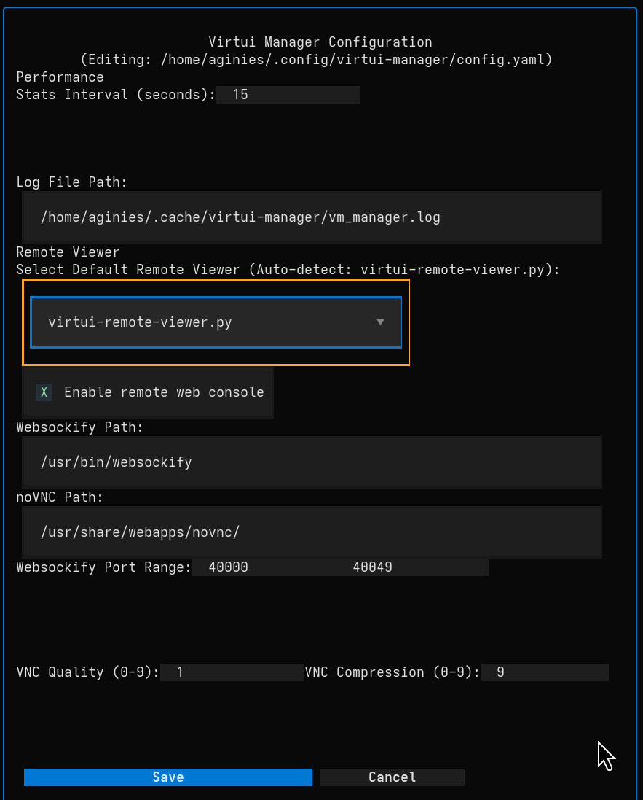
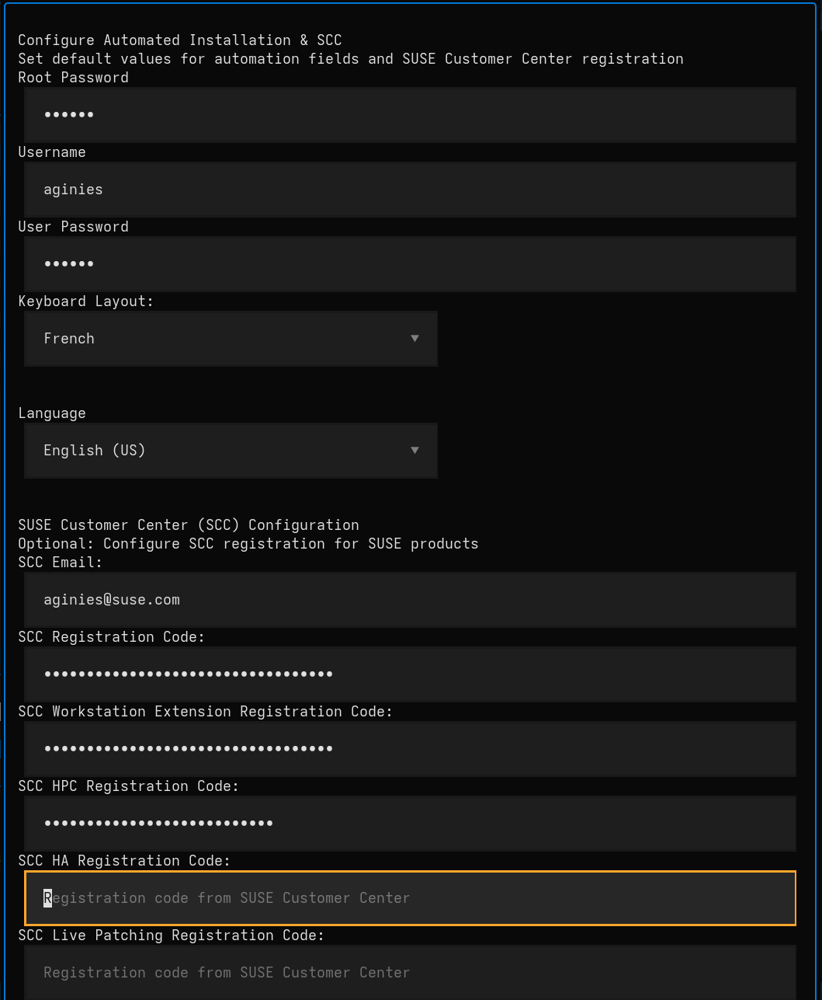
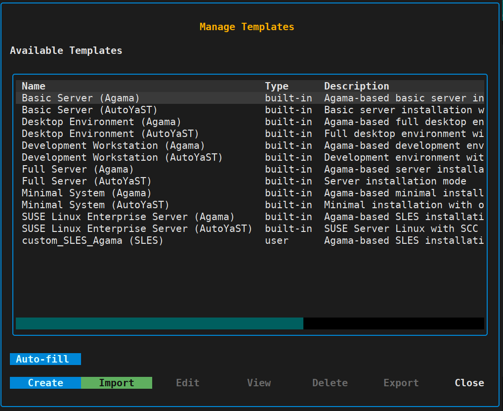

# App Configuration

VirtUI Manager allows you to customize various aspects of its behavior, including performance settings, logging, and remote viewer integration.

To access the configuration, press **`c`** on your keyboard while in the main window.



## Configuration File

VirtUI Manager uses a YAML configuration file for customization:

*   **User-specific:** `~/.config/virtui-manager/config.yaml`
*   **System-wide:** `/etc/virtui-manager/config.yaml`

While most settings can be managed via the UI, VirtUI Manager stores its configuration in these human-readable files. If the user-specific file does not exist, VirtUI Manager will create it with default values upon the first launch or when you save settings from the UI.

A complete sample configuration file is available at [config-sample.yaml](config-sample.yaml) showing all available options with detailed comments.

### Example Configuration

```yaml
# Performance and UI
STATS_INTERVAL: 15
REMOTE_VIEWER: null

# ISO Management
ISO_DOWNLOAD_PATH: /home/isos

# Automated Installation Pre-fill
AUTO_INSTALL_PRE_FILL:
  root_password: "your_default_root_password"
  username: "your_default_username"
  user_password: "your_default_user_password"
  keyboard: "us"
  language: "English (US)"

# SUSE Customer Center (SCC)
SUSE_SCC:
  scc_email: "your-email@company.com"
  scc_reg_code: "your-scc-registration-code"
  scc_product_arch: "x86_64"

# Logging
LOG_FILE_PATH: /home/aginies/.cache/virtui-manager/vm_manager.log
LOG_LEVEL: INFO

# Web Console (noVNC)
REMOTE_WEBCONSOLE: true
novnc_path: /usr/share/webapps/novnc/
websockify_path: /usr/bin/websockify
WEBSOCKIFY_BUF_SIZE: 4096
WC_PORT_RANGE_START: 40000
WC_PORT_RANGE_END: 40049
VNC_QUALITY: 1
VNC_COMPRESSION: 9

# ISO Repositories
custom_ISO_repo:
- name: Alpine 3.23 x86_64
  uri: https://dl-cdn.alpinelinux.org/alpine/v3.23/releases/x86_64/
- name: Slackware 16
  uri: https://mirrors.slackware.com/slackware/slackware-iso/slackware64-15.0-iso/
- name: Qubes R4 3.0
  uri: https://mirrors.edge.kernel.org/qubes/iso/

# Servers List
servers:
- autoconnect: false
  name: Localhost
  uri: qemu:///system
- autoconnect: false
  name: ryzen9
  uri: qemu+ssh://root @10.0.1.38/system
- autoconnect: false
  name: ryzen7
  uri: qemu+ssh://root @10.0.1.78/system
```

### Key Fields Explained

*   **`servers`**: A list of Libvirt connections. Each entry requires a `name` (for display), a `uri` (the Libvirt connection string), and an optional `autoconnect` boolean.
*   **`ISO_DOWNLOAD_PATH`**: The directory where downloaded ISO images are stored.
*   **`custom_ISO_repo`**: A list of remote or local repositories. Each entry needs a `name` and a `uri` (HTTP/HTTPS URL or local path).
*   **`AUTO_INSTALL_PRE_FILL`**: Pre-configured values for automated installation fields that automatically populate when creating VMs with automation templates.
*   **`SUSE_SCC`**: SUSE Customer Center registration credentials for automatic SCC registration during SUSE product installations.

## Automated Installation Pre-fill

VirtUI Manager supports pre-filling automation fields to streamline the VM creation process when using unattended installation templates. This configuration allows you to set default values that automatically populate the automation fields, saving time during VM provisioning.



### Configuration

Add the `AUTO_INSTALL_PRE_FILL` section to your `config.yaml` file:

```yaml
AUTO_INSTALL_PRE_FILL:
  root_password: "your_secure_root_password"
  username: "your_preferred_username"
  user_password: "your_secure_user_password"
  keyboard: "us"              # Keyboard layout (us, fr, de, etc.)
  language: "English (US)"    # System language
```

### Available Fields

*   **`root_password`**: Default password for the root/administrator account
*   **`username`**: Default name for the primary user account  
*   **`user_password`**: Default password for the primary user account
*   **`keyboard`**: Default keyboard layout (e.g., "us", "fr", "de", "it")
*   **`language`**: Default system language (e.g., "English (US)", "Français", "Deutsch")

### How It Works

1. **Template Management**: Press **`t`** to access the Template Management modal and click the **"Auto-Fill"** button to configure pre-fill values
2. **Template Selection**: When you select an automation template during VM creation, VirtUI Manager checks for `AUTO_INSTALL_PRE_FILL` configuration  
3. **Auto-Population**: If configured values exist, the corresponding fields are automatically filled with your preset values
4. **Manual Override**: You can still modify any pre-filled values before creating the VM
5. **Secure Storage**: Consider using secure values and restricting file permissions (`chmod 600`) for the config file if it contains passwords



### Security Considerations

*   **File Permissions**: Ensure your config file has appropriate permissions to protect sensitive information:
    ```bash
    chmod 600 ~/.config/virtui-manager/config.yaml
    ```
*   **Password Complexity**: Use strong passwords for default values
*   **Environment-Specific**: Consider using different configurations for development vs. production environments
*   **Version Control**: If storing config files in version control, use placeholders instead of real passwords

## SUSE Customer Center (SCC) Configuration

VirtUI Manager supports automatic SUSE Customer Center (SCC) registration during SUSE product installations. This feature allows you to configure your SCC credentials that will be automatically used when creating VMs with SUSE operating systems (SLES, etc.).

### Configuration

Add the `SUSE_SCC` section to your `config.yaml` file:

```yaml
SUSE_SCC:
  scc_email: "your-email@company.com"           # Your SCC account email
  scc_reg_code: "your-scc-registration-code"    # Your SCC registration code
  scc_ha_reg_code: "your-scc-ha-registration-code"
  scc_hpc_reg_code: "your-scc-hpc-registration-code"
  scc_ltss_reg_code: "your-scc-ltss-registration-code"
  scc_lpatching_reg_code: "your-scc-live-patching-registration-code"
  scc_we_reg_code: "your-scc-registration-code"
  scc_product_arch: "x86_64"                    # Target architecture
```

### Available Fields

*   **`scc_email`**: Your SUSE Customer Center account email address  
*   **`scc_reg_code`**: Registration code from your SUSE Customer Center account
*   **`scc_ha_reg_code`**: Registration code for HA
*   **`scc_hpc_reg_code`**: Registration code for HPC
*   **`scc_we_reg_code`**: Registration code for Workstation Extensionrom
*   **`scc_ltss_reg_code`**: Registration code for LTSS
*   **`scc_lpatching_reg_code`**: Registration code for Live Patching
*   **`scc_product_arch`**: Target product architecture for registration

### Supported Architectures

*   **`x86_64`**: Standard 64-bit Intel/AMD architecture (default)
*   **`aarch64`**: ARM 64-bit architecture
*   **`s390x`**: IBM System z architecture
*   **`ppc64le`**: PowerPC 64-bit Little Endian

### How It Works

1. **Automatic Integration**: When creating VMs with SUSE distributions and automation templates, VirtUI Manager automatically includes your SCC credentials
2. **Registration Process**: The automated installation will register the system with SUSE Customer Center during the installation process
3. **Product Updates**: Registered systems gain access to official SUSE updates and support packages
4. **Enterprise Support**: Essential for SLES and other commercial SUSE products

### Security Considerations

*   **Sensitive Data**: SCC registration codes are sensitive credentials that provide access to SUSE services
*   **File Permissions**: Ensure your config file has restrictive permissions:
    ```bash
    chmod 600 ~/.config/virtui-manager/config.yaml
    ```
*   **Environment Separation**: Use different SCC credentials for development vs. production environments
*   **Version Control**: Never commit real SCC credentials to version control systems

### Configuration Management

The SCC configuration can be managed through:

1. **Template Management UI**: Press **`t`** to access Template Management modal and click **"Auto-Fill"** button to configure SCC registration codes
2. **Manual Editing**: Directly edit the `config.yaml` file

### Integration with Automated Installation

When both `AUTO_INSTALL_PRE_FILL` and `SUSE_SCC` are configured, VirtUI Manager creates a complete automated installation experience for SUSE products:

*   User accounts and passwords are pre-configured
*   Keyboard and language settings are set
*   SCC registration happens automatically
*   Systems are ready for immediate use with updates enabled

**Note**: SCC registration is only relevant for SUSE-based operating systems. The configuration is safely ignored when installing other Linux distributions.

## Custom ISO Repositories

VirtUI Manager supports adding custom ISO repositories for VM provisioning. These repositories appear in the distribution dropdown during VM creation, allowing you to use ISOs from various sources beyond the built-in OpenSUSE distributions.

### Repository Types Supported

*   **HTTP/HTTPS URLs**: Remote directory listings are automatically scraped for .iso files
*   **Local Absolute Paths**: Direct paths to directories containing ISO files  
*   **file:// URLs**: File protocol URLs to local directories

### Configuration Format

Add custom repositories to your `config.yaml` file using this YAML format:

```yaml
custom_ISO_repo:
  - name: Slackware 15
    uri: https://mirrors.slackware.com/slackware/slackware-iso/slackware64-15.0-iso/
  - name: Qubes R4 3.0
    uri: https://mirrors.edge.kernel.org/qubes/iso/
  - name: Windows
    uri: /mnt/install/ISO/win/
  - name: Local ISOs
    uri: file:///home/user/Downloads/isos/
  - name: Ubuntu Releases
    uri: https://releases.ubuntu.com/
  - name: Debian ISOs
    uri: https://cdimage.debian.org/debian-cd/current/amd64/iso-cd/
```

### Repository Features

*   **Architecture Filtering**: Automatically filters ISOs by host architecture (x86_64, aarch64)
*   **Parallel Processing**: Fetches ISO details concurrently for better performance
*   **Date Extraction**: Gets Last-Modified dates from HTTP headers for remote repositories
*   **SSL Compatibility**: Handles mirrors with certificate issues gracefully
*   **Error Recovery**: Graceful fallbacks for network or parsing errors

### Usage Examples

**Linux Distributions:**
```yaml
# Slackware Linux
- name: Slackware 15
  uri: https://mirrors.slackware.com/slackware/slackware-iso/slackware64-15.0-iso/

# Alpine Linux
- name: Alpine 3.23
  uri: https://dl-cdn.alpinelinux.org/alpine/v3.23/releases/x86_64/

# Ubuntu
- name: Ubuntu Releases  
  uri: https://releases.ubuntu.com/
```

**Specialized Systems:**
```yaml
# Qubes OS Security-focused OS
- name: Qubes R4
  uri: https://mirrors.edge.kernel.org/qubes/iso/

# Tails Privacy OS
- name: Tails
  uri: https://mirrors.edge.kernel.org/tails/stable/
```

**Local Repositories:**
```yaml
# Local mounted drive
- name: Windows
  uri: /mnt/install/ISO/win/

# Network mounted share
- name: Enterprise ISOs
  uri: /mnt/nfs/iso-library/

# User downloads directory
- name: Downloaded ISOs
  uri: file:///home/user/Downloads/isos/
```

### How It Works

1. **Repository Detection**: VirtUI Manager automatically detects whether a URI is HTTP-based or local
2. **Content Scanning**: For HTTP repositories, it scrapes directory listings; for local paths, it scans the filesystem
3. **ISO Discovery**: Finds all .iso files and extracts metadata like file size and modification date
4. **Architecture Filtering**: Filters ISOs based on your system architecture when possible
5. **UI Integration**: Custom repositories appear alongside built-in distributions in the VM creation dialog

### Tips

*   Use descriptive names to easily identify repositories in the UI
*   For large remote repositories, the initial scan may take a few seconds
*   Local paths should be absolute paths (starting with `/`) or use the `file://` protocol
*   Network-mounted directories work just like local paths
*   Repository contents are cached temporarily to improve performance

## Performance

*   **Stats Interval (seconds):**
    *   Determines how frequently the application updates VM status and statistics (CPU, Memory, I/O).
    *   **Default:** `15` seconds.
    *   **Tip:** Increasing this value can reduce the load on the host system, while decreasing it provides more real-time updates.

## Logging

*   **Log File Path:**
    *   The full path where the application writes its log file.
    *   Useful for troubleshooting issues.

*   **Log Level:**
    *   Sets the verbosity of the log file.
    *   **Options:** `DEBUG`, `INFO` (Default), `WARNING`, `ERROR`, `CRITICAL`.
    *   **Tip:** Use `DEBUG` for detailed troubleshooting, but be aware that it can generate large log files.

## Remote Viewer

This section controls how the graphical console of VMs is accessed.

*   **Select Default Remote Viewer:**
    *   Choose the application used to view the VM's display.
    *   **Options:**
        *   `virtui-remote-viewer.py`: The built-in viewer (recommended).
        *   `virt-viewer`: The standard external viewer.
        *   `null`: Auto-detects an available viewer.

## Web Console (noVNC)

These settings configure the built-in web-based remote console capabilities, useful for headless server environments or accessing VMs via a browser.

*   **Enable remote web console:**
    *   Toggles the availability of the web console feature.
    *   When enabled, it allows secure SSH and noVNC remote viewing.
*   **Websockify Path:**
    *   Path to the `websockify` binary, which translates VNC traffic to WebSockets.
    *   **Default:** `/usr/bin/websockify`
*   **Websockify Buffer Size:**
    *   Buffer size for the websockify connection.
    *   **Default:** `4096`
*   **noVNC Path:**
    *   Path to the noVNC web assets (HTML/JS/CSS).
    *   **Default:** `/usr/share/webapps/novnc/` (common on Arch/Manjaro) or `/usr/share/novnc/` (Debian/Ubuntu).
*   **Websockify Port Range:**
    *   Defines the range of local ports the application can use for WebSocket connections.
    *   **Start:** Default `40000`
    *   **End:** Default `40049`
*   **VNC Quality (0-9):**
    *   Sets the visual quality of the VNC stream.
    *   **Range:** 0 (Lowest) to 9 (Highest).
    *   **Default:** `1` (Optimized for speed).
*   **VNC Compression (0-9):**
    *   Sets the compression level for the VNC stream.
    *   **Range:** 0 (None) to 9 (Maximum).
    *   **Default:** `9` (Maximum compression to save bandwidth).
