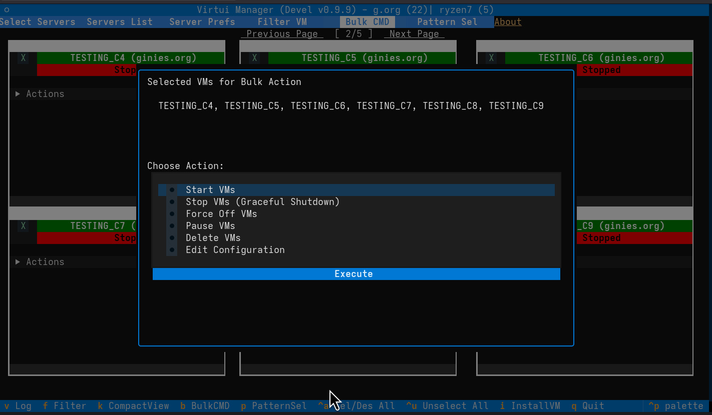

# Bulk Operations

Bulk operations allow you to execute commands across multiple Virtual Machines simultaneously, significantly reducing the time required for fleet management.

## Getting Started

To perform bulk operations, you must first select the target VMs. You can use any of the methods described in the [Selection & Filtering](selection.md) chapter:

*   Manual clicking of the 'X' on VM cards.
*   `Ctrl+A` to select all.
*   `Pattern Sel` (shortcut `p`) for regex/glob matching.

Once VMs are selected, the **Bulk CMD** button (or shortcut `b`) becomes your primary tool.

## Executing Commands

When you enter Bulk Command mode, a menu appears presenting actions that can be applied to your entire selection:

### Power Management

*   **Start:** Boot all selected stopped VMs.
*   **Shutdown:** Send an ACPI shutdown signal to all running selected VMs.
*   **Force Off:** Immediately terminate selected VMs (equivalent to pulling the power plug).
*   **Reboot:** Perform a graceful reboot of all selected machines.

### Configuration & State

*   **Pause / Resume:** Suspend or continue execution for the selected group.
*   **Delete:** Remove multiple VMs at once. *Use with caution.*
*   **Snapshots:** Create or manage snapshots for the entire selection (e.g., "Pre-patching" snapshot for all web servers).
*   **Configuration:** Its possible to change the configurationfor all VM selected. This should be done with caution as this can lead to major issue for VM.

## Safety and Feedback

*   **Confirmation:** For destructive actions like "Delete" or "Force Off," VirtUI Manager will ask for confirmation to prevent accidental data loss.
*   **Parallel Execution:** Actions are triggered in an optimized sequence, allowing you to monitor the progress across the grid as VM statuses update in real-time.
*   **Selection:** After a bulk operation, your selection dont persists, to avoid any error.
