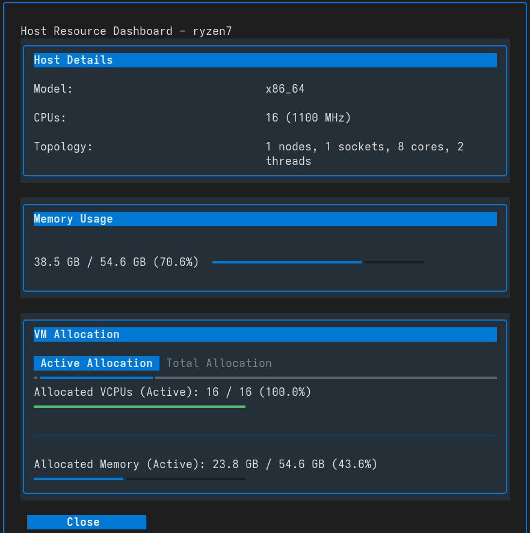

# Host Management

VirtUI Manager provides built-in tools to inspect the host system's resources and capabilities directly from the TUI.

## Host Resource Dashboard

The **Host Resource Dashboard** provides a real-time overview of the hypervisor's resource usage and how it's being allocated to virtual machines.

To open the dashboard, press **`H`** (Shift+h) while in the main window.

### Dashboard Sections

*   **Host Details:** Displays static information about the host hardware, including the CPU model, frequency, and topology (nodes, sockets, cores, threads).
*   **Memory Usage:** Shows the current RAM usage of the host operating system. A progress bar visualizes the ratio of used to total memory.
*   **VM Allocation:**
    *   **Active Allocation:** Shows the total resources (vCPUs and RAM) reserved by currently *running* VMs. This is crucial for avoiding overcommitment of active resources.
    *   **Total Allocation:** Shows the resources reserved if *all* defined VMs (running and stopped) were to be started simultaneously.
    *   **Colors:** The progress bars change color (Green -> Yellow -> Orange -> Red) to indicate allocation levels, warning you when you are approaching or exceeding physical limits.

## Host Capabilities

The **Host Capabilities** viewer allows you to explore the low-level features supported by the hypervisor and host hardware. This is a tree-based view of the XML capabilities returned by Libvirt.

To open the capabilities viewer, press **`h`** while in the main window.

### Using the Tree View

*   **Navigation:** Use the **Up/Down** arrow keys to move through the tree.
*   **Expansion:** Press **Enter** or **Space** to expand or collapse nodes (e.g., `guest`, `host`, `cpu`).
*   **Search:** Type directly into the search bar at the top to filter the tree nodes. This is useful for finding specific CPU flags (e.g., `vmx`, `aes`) or supported device models.

### Key Information Available

*   **Host UUID:** The unique identifier of the host machine.
*   **CPU Features:** Detailed list of supported CPU instructions and security features.
*   **Migration Features:** supported migration schemes (e.g., `live`, `rdma`).
*   **Topology:** NUMA nodes and cache hierarchy.
*   **Guest Support:** Lists all guest architectures (e.g., `x86_64`, `i686`) and machine types supported by this KVM installation.
