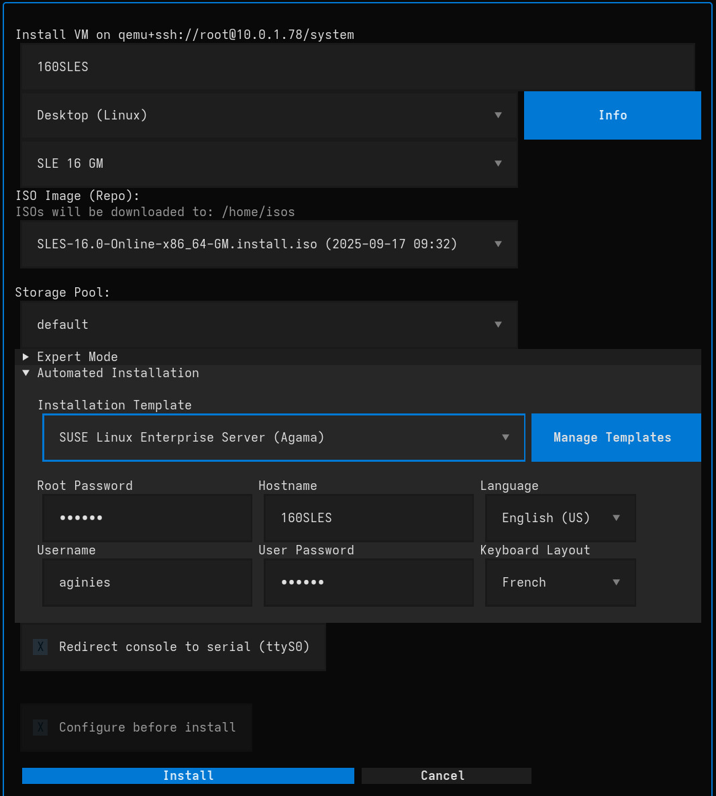

# VM Installation

VirtUI Manager provides a streamlined wizard for provisioning new virtual machines, with a focus on ease of use for OpenSUSE distributions while supporting custom ISOs. The interface supports multiple languages including English, French, German, and Italian.

To start the installation wizard, press **`i`** on your keyboard while in the main window.



## The Installation Wizard

The wizard guides you through the necessary steps to configure your new VM.

### Basic Configuration

*   **VM Name:**
    *   Enter a unique name for your virtual machine.
    *   *Note:* The name will be automatically sanitized to ensure compatibility (e.g., spaces replaced with hyphens).

*   **VM Type:**
    *   Select a preset profile that automatically adjusts hardware resources (CPU, RAM, Disk) based on the intended use case. Click the **Info** button next to the dropdown to see a detailed comparison of the different types.
    *   **Desktop (Linux):** Balanced resources for general Linux desktop use (Default).
    *   **Windows:** Optimized for modern Windows installations (SATA bus, TPM enabled).
    *   **Windows Legacy:** Optimized for older Windows versions or specific compatibility needs (SATA bus, BIOS boot, USB input).
    *   **Server:** More CPU/RAM, larger disk, optimized for server workloads.
    *   **Computation:** High CPU/RAM ratio for compute-intensive tasks, uses raw disk format and virtio networking.
    *   **Secure VM:** Hardened configuration with TPM and SEV (Secure Encrypted Virtualization) support.

*   **Distribution:**
    *   Choose the operating system source.
    *   **Cached ISOs:** Select from ISO images already downloaded to your local cache. The path to the cache is displayed below the selection.
    *   **OpenSUSE Variants:** Select a specific OpenSUSE distribution (e.g., Leap, Tumbleweed, Slowroll) to automatically fetch the latest ISO.
    *   **Ubuntu Variants:** Select a specific Ubuntu distribution to automatically fetch the latest ISO.
    *   **From Storage Pool:** Select an ISO image directly from an existing libvirt storage pool.
    *   **Custom:** Use a local ISO file from your file system.

*   **ISO Image (Repo / Volume):**
    *   Depending on the selected Distribution, pick the specific image from the dropdown. 
    *   If a remote distribution is selected, the ISO will be downloaded automatically to the displayed **ISO Download Path**.
    *   If **From Storage Pool** is selected, you will:
        1. First select the storage pool from the dropdown
        2. Then select the specific ISO volume from within that storage pool
        3. The ISO volume selection will automatically populate once a storage pool is chosen

### Custom ISO Repositories

You can define your own ISO repositories in the `config.yaml` file. This allows you to add custom distributions to the selection menu by providing a URL to a directory containing ISO files.

Add the `custom_ISO_repo` key to your configuration file with the following syntax:

```yaml
custom_ISO_repo:
  - name: Alpine 3.23 x86_64
    uri: https://dl-cdn.alpinelinux.org/alpine/v3.23/releases/x86_64/
```

These repositories will then be available in the **Distribution** selection dropdown. When selected, VirtUI Manager will fetch and display the available `.iso` files from that location.

### Custom ISO Options

*Visible only when "Custom" distribution is selected.*

*   **Custom ISO (Local Path):** Enter the full path or browse for a local `.iso` file.
*   **Validate Checksum:** Optionally verify the integrity of the ISO file using a SHA256 checksum before installation.

### Expert Mode

Click the "Expert Mode" header to reveal advanced hardware settings. These default to values based on the selected **VM Type** but can be overridden.

*   **Memory (MB):** Amount of RAM allocated to the VM.
*   **CPUs:** Number of virtual CPU cores.
*   **Disk Size (GB):** Size of the primary hard disk.
*   **Disk Format:**
    *   `qcow2`: (Default) Supports snapshots and dynamic allocation.
    *   `raw`: Better performance, but consumes full space immediately and lacks snapshot support.
*   **Firmware:**
    *   **UEFI:** (Checked by default) Modern boot firmware. Uncheck for Legacy BIOS.

### Storage

*   **Storage Pool:** Select the libvirt storage pool where the VM's disk image will be created. Defaults to `default`.

### Automated Installation

VirtUI Manager supports unattended installations using predefined templates for supported distributions. This feature automatically configures the operating system during installation, eliminating the need for manual interaction.

*   **Template Selection:** Choose from available automation templates for your selected distribution:
    *   **None:** (Default) Manual installation - you will interact with the installer normally.
    *   **Distribution-specific templates:** Pre-configured templates that automate the installation process.

*   **Automated Installation Fields:** When a template is selected, the following fields become available:
    *   **Root Password:** Password for the root/administrator account.
    *   **Username:** Name for the primary user account.
    *   **User Password:** Password for the primary user account.
    *   **Keyboard Layout:** Keyboard configuration (e.g., "fr" for French, "us" for US English).
    *   **Language:** System language setting (e.g., "English (US)", "Français").

*   **Auto-fill Configuration:** You can pre-configure default values for automation fields in your configuration file. When a template is selected, these values will automatically populate the corresponding fields, speeding up the VM creation process. For detailed configuration instructions, see the [Automated Installation Pre-fill](app_configuration.md#automated-installation-pre-fill) section in the App Configuration documentation.

**Important Notes:**
- When automated installation is enabled, certain options are automatically configured:
  - **UEFI firmware is enforced** (required for automated installations)
  - **"Configure before install" is disabled** (since the template handles configuration)
- The VM will boot directly into the unattended installation process
- Installation progress can be monitored through the remote viewer console

## Starting the Installation

1.  Review your settings.
2.  Click **Install**.
3.  The wizard will download the ISO (if necessary), create the disk image, and define the VM.
4.  Once provisioned, the VM will start automatically, and the remote viewer will launch to display the installation console.
