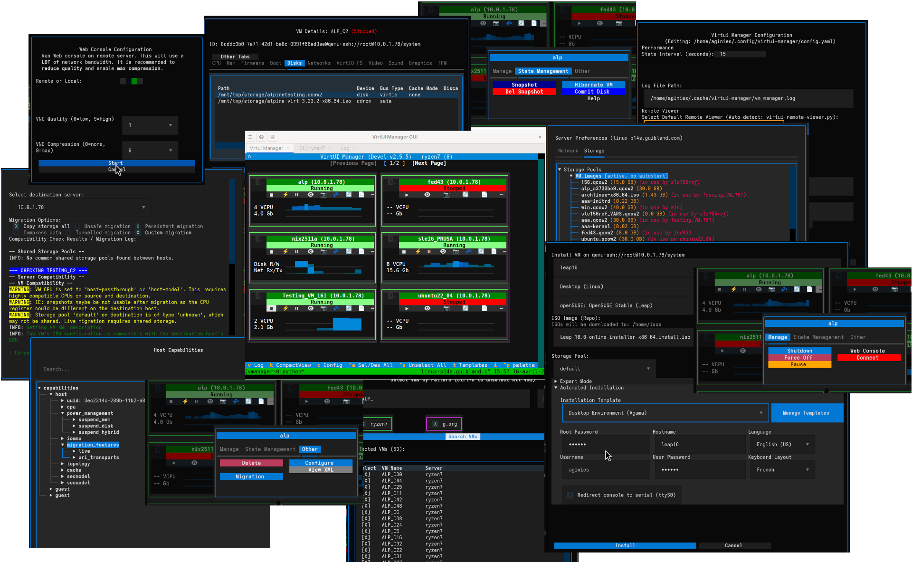

# Introduction to VirtUI Manager

VM management from the terminal. 

VirtUI Manager is a TUI for managing QEMU/KVM VMs via libvirt. Keyboard-centric, no X11 required.

## Why VirtUI Manager?

Managing virtual infrastructure often involves a trade-off between convenience and accessibility. Traditional tools often come with significant drawbacks:

*   **GUI tools (virt-manager)** offer great visualization but require X11 forwarding or a heavy desktop environment, which is slow and resource-intensive over remote connections.
*   **Web interfaces (Cockpit)** can be complex to deploy, feature-incomplete, or lack robust multi-hypervisor support.
*   **CLI tools (virsh)** are fast but lack the overview and ease of use required for complex management tasks.

**VirtUI Manager** solves these challenges by providing a **lightweight, fast, and feature-rich interface** that runs entirely in the terminal.

*   **Actions Menu:** Streamlined "Actions" menu with context-aware options.
*   **Bulk Operations:** Execute commands across multiple VMs with regex patterns and group filters.
*   **Migration:** Migrate workloads between servers. Handles storage, snapshots, and overlays.
*   **No X11 Required:** Runs on headless servers and over SSH.

## Key Features

### 🚀 Performance & Architecture
*   **Event-Driven UI:** Uses libvirt events for real-time updates.
*   **Smart Caching:** Metadata caching reduces API load.
*   **Multi-Server View:** Manage multiple libvirt servers in one dashboard.

### VM Control
*   **Configuration:** Tweak CPU, memory, storage, and networking.
*   **State Mastery:** Full support for snapshots and external disk overlays. Branch your VM states or revert changes with confidence.
*   **Host Info:** Monitor host resources and hardware details (NUMA, CPU topology, cache).

### Provisioning
*   **Provisioning:** Streamlined installation with intelligent defaults, UEFI support, and hardware detection.
*   **Automated Provisioning:** Take deployment to the next level with full automated installation support (Debian, Ubuntu, Fedora, Arch Linux, Alpine, openSUSE/SLES), template management, and intelligent auto-prefill.
*   **Instant Cloning:** Scale out instantly with advanced VM cloning, including auto-provisioning of storage.

### 🖥️ Remote & Advanced Access
*   **VirtUI Remote Viewer:** A custom-built, native graphical viewer for VNC/SPICE consoles with support for USB redirection, real-time log monitoring, and snapshot management.
*   **Secure Web Console:** Integrated `noVNC` support via websockify for browser-based access, even over SSH tunnels.
*   **Tmux Integration:** Multitasking by launching text consoles in separate Tmux windows.
*   **Command Line Interface:** Power users can leverage `vmanager_cmd`, a dedicated shell-like CLI for rapid management and automated pipelines.

## Comparison

| Feature | VirtUI Manager | Virt-Manager | Virsh (CLI) | Cockpit |
| :--- | :--- | :--- | :--- | :--- |
| **Interface** | TUI / GUI (GTK) | GUI (GTK) | CLI (Text) | Web UI |
| **Remote via SSH** | ✅ Excellent | ⚠️ Slow (X11) | ✅ Excellent | ❌ Setup required |
| **Headless Support** | ✅ Native | ❌ No | ✅ Native | ✅ Native |
| **Multi-Server** | ✅ Yes | ✅ Yes | ✅ Yes | ✅ Yes |
| **Resource Usage** | 🟢 Low | 🔴 High | 🟢 Lowest | 🟡 Medium |
| **Installation** | 🟢 Simple (Python) | 🟡 Medium | 🟢 Pre-installed | 🔴 Complex |

## Getting Started

Ready to take control of your virtualization infrastructure?

1.  Check the **[Installation Guide](app_installation.md)** to get set up.
2.  Explore the **[Main Window](main_window.md)** to understand the interface.
3.  Try the **[GUI Console](gui_console.md)** for a modern tabbed experience.
4.  Learn about **[VM Configuration](vm_configuration.md)** to tune your machines.
