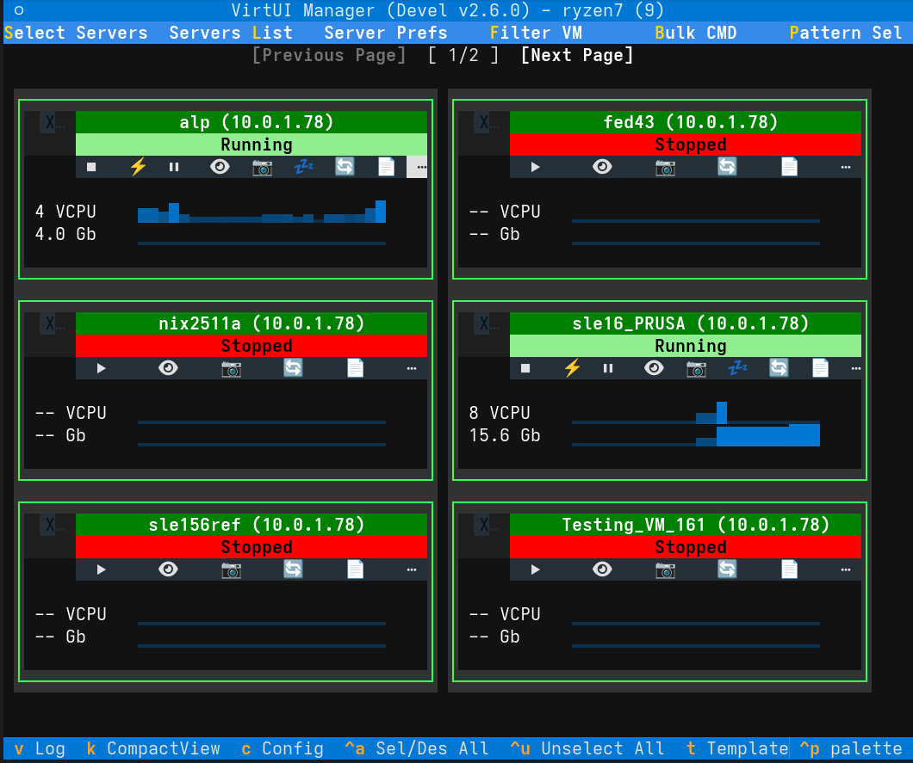

# Management Main Window

The **Management Main Window** is the central hub of VirtUI Manager, designed for efficiency and rapid control of your virtual infrastructure.

## Interface Overview

!!! note
    You can view the application logs at any time by pressing the **`v`** key. This is useful for monitoring background operations and troubleshooting.

The interface is divided into intuitive sections to streamline your workflow:

### Server Management

Located at the top-left, these tools control your connection contexts:

*   **Select Servers (`s`):** Switch the "Single Pane of Glass" view to specific servers (local or remote SSH).
*   **Manage Servers (`l`):** Add, remove, or edit the list of available Libvirt connections.
*   **Server Prefs:** Configure connection details, auto-connect behaviors, and default storage/network pools for new VMs.

### Server List & Navigation

The core view displaying your virtual machines.

*   **Card View:** Each VM is represented as a card showing real-time status, CPU/Memory usage sparklines, and IP addresses.
*   **Compact View (`k`):** Toggles a high-density view showing only selection, name, and status. Ideal for managing large numbers of VMs or when screen space is limited.
*   **Interaction:**
    *   **Double-Click Name:** Triggers a background fetch of full VM data (in detailed view only).
    *   **Sparkline Click:** Toggles between Resource View (CPU/Memory) and I/O View (Disk/Network) performance metrics.
    *   **Navigation:** Use **Arrow Keys** to move focus.
    *   **Pagination:** Use **Left/Right** buttons or keys (when focused) to navigate pages of VMs.

### Filtering & Search (`f`)

Press **`f`** or click the **Filter VM** button to narrow down the list.

*   **Search Text:** Filter by VM name.
*   **Status:** Show only Running, Stopped, or Paused VMs.
*   **Server Scope:** Limit the view to specific servers from your active connection list.

### VM Provisioning (`i`)

Press **`i`** to launch the **VM Installation Wizard**.

*   **Guided Setup:** Select target server, ISO image (local or remote), and allocate resources (CPU, RAM, Disk).
*   **Defaults:** Uses the defaults defined in *Server Prefs* to speed up deployment.

### [Bulk CMD](bulk_ops.md) (`b`)

The "Bulk Command" mode puts the power of fleet management at your fingertips.

*   **Multi-Select:** Manually select cards or use **`Ctrl+a`** (Select All) / **`Ctrl+u`** (Unselect All).
*   **Pattern Selection (`p`):** Select VMs based on name patterns (regex/glob).
*   **Mass Actions:** Perform operations like `Start`, `Shutdown`, `Reboot`, or `Delete` on all selected VMs simultaneously.

### Advanced Tools

*   **Virsh Shell (`Ctrl+v`):** Opens a direct shell to run `virsh` commands against a selected server.
*   **Stats Logging (`Ctrl+l`):** Toggles background logging of performance statistics to the log file. When enabled, logs detailed libvirt call statistics and cache performance every 10 seconds.
*   **Cache Stats (`Ctrl+s`):** Displays internal cache hit/miss statistics for debugging. Shows detailed information about VM data caching efficiency.

## Keyboard Shortcuts Cheat Sheet

| Key | Action |
| :--- | :--- |
| **`s`** | Select Servers |
| **`l`** | Servers List |
| **`f`** | Filter View |
| **`i`** | Install New Virtual Machine |
| **`k`** | Toggle Compact View |
| **`b`** | Bulk Command Mode |
| **`p`** | Pattern Select |
| **`v`** | View Application Log |
| **`c`** | Open App Configuration |
| **`Ctrl+a`** | Select All Visible VMs |
| **`Ctrl+u`** | Unselect All VMs |
| **`Up Arrow`** | Filter: Show Running VMs Only |
| **`Down Arrow`** | Filter: Show All VMs |
| **`Left Arrow`** | Previous Page |
| **`Right Arrow`** | Next Page |
| **`Ctrl+v`** | Open Virsh Shell |
| **`Ctrl+l`** | Toggle Statistics Logging |
| **`Ctrl+s`** | Show Cache Statistics |
| **`q`** | Quit Application |
