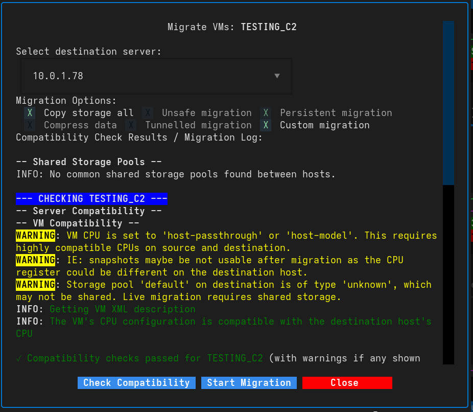

# Virtual Machine Migration

VirtUI Manager provides a powerful interface for migrating Virtual Machines between Libvirt hosts. It supports both standard live migration (using shared storage) and a custom migration mode that handles non-shared storage scenarios by copying disk images.

## Accessing Migration

To initiate a migration, select a VM from the main list and choose the **Migrate** option from the **Actions** menu (or press `m`).

## Migration Interface

The migration interface guides you through the process of selecting a destination and configuring migration parameters.

### 1. Select Destination Server

First, choose the target host from the "Select destination server" dropdown. This list is populated from your configured Libvirt connections.

### 2. Migration Options

VirtUI Manager exposes several Libvirt migration flags:

*   **Copy storage all:**  Used for non-shared storage migration. It instructs Libvirt to copy the disk images to the destination.
*   **Unsafe migration:** Forces migration even if Libvirt detects potential safety issues (use with caution).
*   **Persistent migration:**  Ensures the VM definition is defined persistently on the destination host, not just running transiently.
*   **Compress data:** Compresses migration data to save bandwidth.
*   **Tunnelled migration:** Tunnels migration data through the libvirt connection (often SSH), avoiding the need for extra open ports but potentially slower.
*   **Custom migration:**  Enables VirtUI Manager's advanced handling for complex scenarios (see below).

## Compatibility Checks

Before starting the actual migration, you can (and should) run a **Check Compatibility**.

The compatibility check performs several verifications:

*   **Server Connectivity:** Ensures the destination is reachable.
*   **CPU Compatibility:** Checks if the destination host CPU supports the VM's CPU configuration (especially important for `host-passthrough` or `host-model`).
*   **Storage Pools:** Checks if required storage pools exist on the destination.
*   **Disk Availability:** Verifies if disk images or paths are accessible or need to be created.

!!! warning "CPU Compatibility"
    If you see warnings about CPU incompatibility, the migration might fail or the VM might crash on the destination. You may need to change the VM's CPU mode to a more generic model (e.g., `x86_64` or `kvm64`) before migrating.

## Custom Migration (Non-Shared Storage)

For environments without shared storage (like NFS or iSCSI/SAN), VirtUI Manager's **Custom Migration** features are essential.

When "Custom migration" is enabled, VirtUI Manager attempts to:

1.  **Analyze Disks:** Identifies all disks attached to the VM.
2.  **Create Storage:** If the destination storage pool exists but the volume doesn't, it can create the necessary empty volumes on the destination.
3.  **Handle Overlays:**  It has logic to handle qcow2 backing chains, ensuring the base images exist on the destination.

## Performing the Migration

1.  Select the destination.
2.  Adjust flags (default settings are usually safe for most "copy storage" needs).
3.  Click **Check Compatibility** and review the log output in the black terminal window.
4.  If checks pass (green text), click **Start Migration**.
5.  Monitor the progress. The window will close automatically upon successful completion.

## Troubleshooting

*   **"Unsafe" Error:** If Libvirt refuses migration due to cache mode or disk type, enabling "Unsafe migration" might be required, but understand the risks of data corruption if the storage isn't truly shared or handled correctly.
*   **Permission Denied:** Ensure the `libvirt-qemu` (or equivalent) user has read/write access to the storage pools on both source and destination.
*   **Network Timeouts:** For large RAM VMs, migration might stall. Ensure you have high bandwidth or increase the downtime limit (currently handled automatically by Libvirt defaults).
