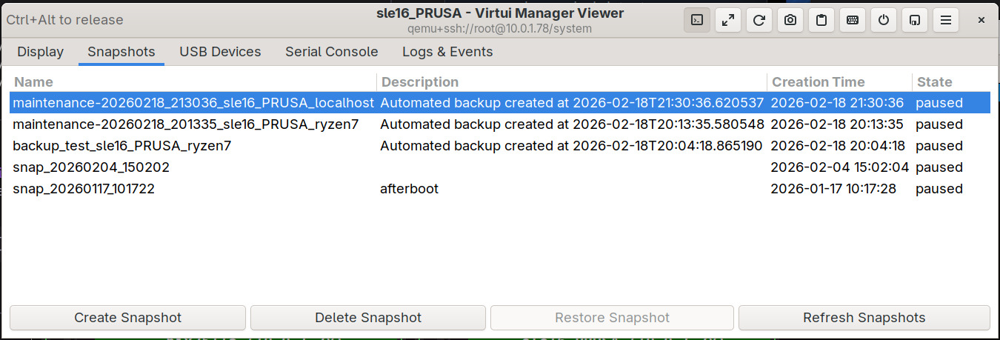

# Virtui Remote Viewer

The **Virtui Remote Viewer** is a custom-built, high-performance graphical console integrated directly into Virtui Manager. It provides a seamless way to interact with your Virtual Machines without needing external tools like `virt-viewer` or `virt-manager`.

It supports both **VNC** and **SPICE** protocols and offers advanced features like USB redirection and snapshot management directly from the viewer window.

## Interface Overview

The viewer is designed to be intuitive, with a toolbar at the top and a tabbed interface for advanced controls.

### Main Toolbar

The header bar provides quick access to essential functions:

*   **Settings Menu:** Configure display scaling, smoothing, compression, and view-only mode.
*   **Power Menu:** Quickly Start, Pause, Resume, Shutdown, or Force Off the VM.
*   **Send Keys:** Send special key combinations like `Ctrl+Alt+Del` or `Ctrl+Alt+F1` directly to the guest.
*   **Clipboard:** Push/Pull text to and from the guest clipboard.
*   **Screenshot:** Capture the current state of the VM display to a file.
*   **Fullscreen:** Toggle fullscreen mode for an immersive experience.
*   **Logs & Events:** Toggle the visibility of the logs and events panel.

## Features

### Display Settings

You can customize the viewing experience to match your network conditions and preferences:

*   **Scaling:** Resize the guest display to fit the window.
*   **Smoothing:** Enable interpolation for better image quality when scaled.
*   **Lossy Compression:** Use JPEG compression to reduce bandwidth usage (useful for slow connections).
*   **Color Depth:** Adjust the color depth (8-bit, 16-bit, 24-bit) to balance quality and performance.

### Snapshot Management

The **Snapshots** tab allows you to manage VM snapshots without leaving the viewer.

*   **Create Snapshot:** Take a new snapshot of the current state. You can optionally "quiesce" the guest file system for data consistency (requires QEMU Guest Agent).
*   **Restore Snapshot:** Revert the VM to a previous state. *Note: The VM must be stopped to restore a snapshot.*
*   **Delete Snapshot:** Remove old snapshots to free up space.

### USB Redirection

The **USB Devices** tab enables you to pass through USB devices from your local machine (the one running Virtui Manager) directly to the VM.

*   **Attach USB:** Select a device from the "Available Host USB Devices" list and click "Attach" to make it available to the guest.
*   **Detach USB:** Select an attached device and click "Detach" to return control to the host.

### Logs & Events

The **Logs & Events** tab provides a real-time stream of internal operations, libvirt events, and debugging information. This is invaluable for troubleshooting connection issues or monitoring background tasks.

*   **Connection Details:** View SSH tunnel status and VNC/SPICE handshake information.
*   **Libvirt Events:** See lifecycle events (Started, Stopped, Paused) as they happen.
*   **Debug Info:** detailed logs for developers and power users.

## Connectivity

Virtui Remote Viewer handles connections intelligently:

*   **Local:** Connects directly to local libvirt instances via Unix sockets.
*   **SSH Tunneling:** When managing remote servers, it automatically establishes secure SSH tunnels for VNC/SPICE traffic, ensuring your data is encrypted.
*   **Direct Attach:** Can attach to existing file descriptors for seamless integration.

## Keyboard Shortcuts

*   **`Ctrl+F`:** Toggle Fullscreen
