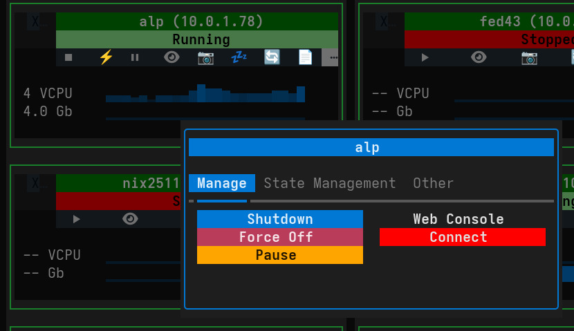

# VM Actions

The Actions panel is the control center for each Virtual Machine. It is revealed by clicking the "Actions" collapsible header on a VM card.

The available operations are organized into three tabs: **Manage**, **Snapshot/Overlay**, and **Other**.

## Manage Tab

This tab contains the most common power management and connectivity controls.

*   **Start:**
    *   Boots the virtual machine.
    *   *Visible when the VM is Stopped.*

*   **Shutdown:**
    *   Sends an ACPI shutdown signal to the guest operating system, requesting a graceful shutdown.
    *   *Visible when the VM is Running.*

*   **Force Off:**
    *   Forcefully terminates the VM process. This is equivalent to pulling the power plug and may cause data loss.
    *   *Visible when the VM is Running or Paused.*

*   **Pause:**
    *   Pauses the execution of the VM, freezing its state in memory.
    *   *Visible when the VM is Running.*

*   **Resume:**
    *   Resumes execution of a paused VM.
    *   *Visible when the VM is Paused.*

*   **Configure:**
    *   Opens a detailed view of the VM's hardware configuration (CPU, Memory, Disks, Networks, etc.).

*   **Web Console / Show Console:**
    *   **Web Console:** Configures and starts a secure noVNC session, allowing you to access the VM's display via a web browser. Useful for remote access without a dedicated client.
    *   **Show Console:** appears when a session is active; clicking it opens the browser or reconnects.

*   **Connect:**
    *   Launches the configured desktop remote viewer (e.g., `virt-viewer`) for a high-performance native connection to the VM's display (SPICE/VNC).

## Snapshot/Overlay Tab

This tab provides advanced storage management features for version control and testing.

### Snapshots
Snapshots save the state of the virtual machine (disk and memory) at a specific point in time.

*   **Snapshot:**
    *   Creates a new snapshot. You can provide a name and description.
    *   *Visible when the VM is Running or Paused.*

*   **Restore Snapshot:**
    *   Reverts the VM to a selected snapshot state.
    *   *Visible when the VM is Stopped.*

*   **Del Snapshot:**
    *   Permanently deletes a selected snapshot.

### Overlays
Overlays (or "Linked Clones" for a single disk) allow you to create a temporary writable layer on top of your base disk image. This is ideal for testing potentially destructive changes.

*   **New Overlay:**
    *   Creates a new overlay file backed by the current disk image. Changes are written to the overlay, leaving the original disk untouched.
    *   *Visible when the VM is Stopped and no overlay exists.*

*   **Commit Disk:**
    *   Merges changes from the active overlay back into the base backing file.
    *   *Visible when the VM is Running and using an overlay.*

*   **Discard Overlay:**
    *   Deletes the overlay file, discarding all changes made since it was created, and reverts the VM to the base image.
    *   *Visible when the VM is Stopped and using an overlay.*

*   **Help:**
    *   Displays a guide on how to use the Overlay feature.

## Other Tab

This tab contains administrative actions for the VM lifecycle.

*   **Delete:**
    *   Permanently deletes the virtual machine. You will be prompted to choose whether to delete the associated storage (disk images) or keep them.

*   **! Clone !:**
    *   Creates a duplicate of the VM.
    *   **Linked Clone:** Clones the definition but shares the disk image (saves space, fast).
    *   **Full Clone:** Copies the entire disk image (slower, fully independent).
    *   *Visible when the VM is Stopped.*

*   **! Migration !:**
    *   Moves the VM to another server managed by Virtui Manager.
    *   Requires SSH connectivity between hosts.

*   **View XML / Edit XML:**
    *   **View XML:** Displays the raw Libvirt XML configuration for inspection. (*Visible when Running*)
    *   **Edit XML:** Opens an editor to manually modify the VM's XML configuration. (*Visible when Stopped*)

*   **Rename:**
    *   Changes the name of the virtual machine.
    *   *Visible when the VM is Stopped.*
