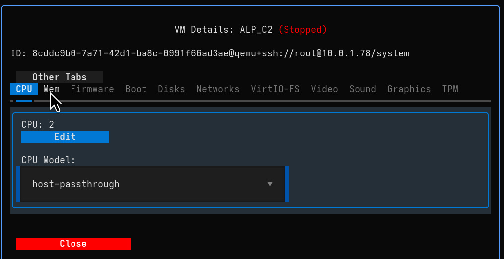
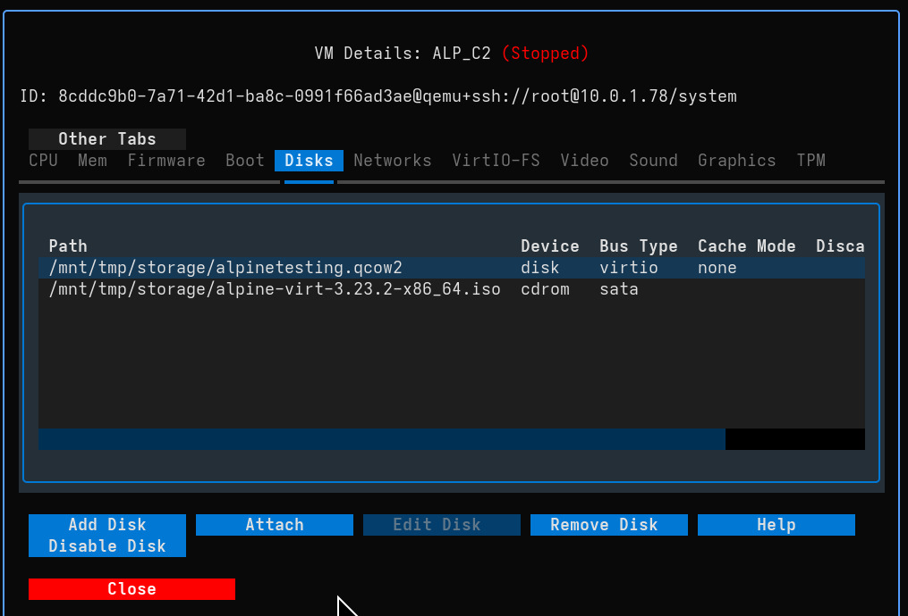

# VM Configuration

The **VM Configuration** modal allows you to fine-tune every aspect of your virtual machines, from resource allocation to hardware passthrough.

To access configuration:
*   **Single VM:** Double-click on a VM card (or press Enter when selected).
*   **Bulk Edit:** Select multiple VMs and use the **Bulk CMD** menu (or press `b`).

## General Resources

Adjust the core computing resources for your VM.

*   **CPU:**
    *   **Cores:** Set the number of vCPUs.
    *   **Model:** Choose the CPU model. `host-passthrough` provides best performance, while specific models (e.g., `EPYC`, `Skylake`) ensure migration compatibility.
*   **Memory:**
    *   **Size:** Allocate RAM (in MB).
    *   **Shared Memory:** Enable this if you plan to use VirtIO-FS for file sharing.
*   **Firmware & Security:**
    *   **Firmware:** Switch between BIOS and UEFI modes.
    *   **Secure Boot:** Enable for modern OS security requirements (requires UEFI).
    *   **AMD SEV/SEV-ES:** Enable memory encryption features (if supported by host hardware).
    *   **Machine Type:** Update the QEMU machine type version (e.g., `pc-q35-6.0` to `pc-q35-7.0`) to access new hypervisor features.

## Boot Management

Control how the VM starts up.

*   **Boot Order:** Reorder devices using the **Up** and **Down** buttons to prioritize boot targets.
*   **Boot Menu:** Enable the interactive boot menu (accessible via `F12` during POST).
*   **Devices:** Add or remove Disks and Network Interfaces from the boot sequence using the arrow buttons.

## Storage & Networking

Manage your virtual disks and network connections.

### Disks
*   **Management:** Add new virtual disks, attach existing images/volumes, or remove/disable current drives.
*   **Modes:** Configure **Cache** (e.g., `none`, `writeback`) and **Discard** (e.g., `unmap`) settings for performance optimization and storage efficiency.

### Networks
*   **Interfaces:** Add or remove network adapters.
*   **Model:** Select the NIC model (e.g., `virtio` for performance, `e1000e` for compatibility).
*   **Connection:** Switch networks (e.g., from `default` NAT to a bridge) on the fly.

### VirtIO-FS
Share directories from the host to the guest efficiently without network overhead.
*   **Requirement:** Requires **Shared Memory** to be enabled in the Memory tab.
*   **Setup:** Map a host source path to a guest mount tag.

## Hardware & Peripherals

Configure advanced hardware integration and display settings.

### Graphics & Display
*   **Video Model:** Select the video adapter (e.g., `virtio` for 3D acceleration, `qxl`, `vga`, `none`).
*   **Graphics Type:** Choose between **VNC** (broad compatibility) and **SPICE** (better desktop integration).
*   **Remote Access:** Configure listen addresses, ports, and passwords for remote connections.
*   **3D Acceleration:** Enable for supported guests (requires `virtio` video model).

### Input & Peripherals
*   **USB Host:** Pass physical USB devices from the host to the VM dynamically.
*   **TPM:** Configure Emulated or Passthrough TPM 2.0 (essential for Windows 11 support).
*   **RNG:** Configure Random Number Generator passthrough for better entropy in the guest.
*   **Watchdog:** Set up automatic actions (reset, shutdown) if the guest OS hangs.

### Serial & Channels
*   **Serial:** Manage serial consoles (PTY) for headless management.
*   **Channels:** Configure QEMU Guest Agent channels for host-guest communication (copy-paste, time sync).

---
!!! tip "Bulk Configuration"
    When multiple VMs are selected via Bulk Edit, changing a setting (like CPU Model or Graphics Password) will apply that change to **all selected VMs** sequentially. This is powerful for fleet updates.
