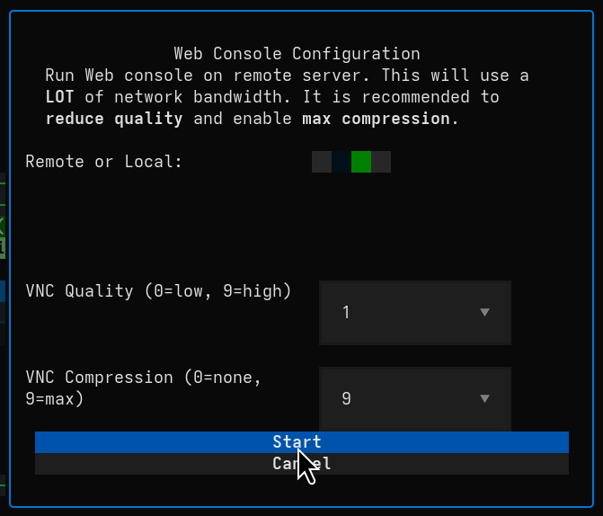
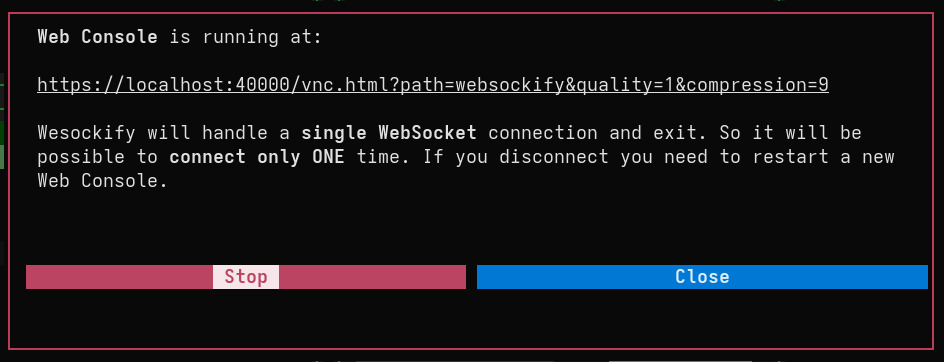

# Web Console (noVNC)

Virtui Manager includes a built-in feature to launch a **Web Console** for any running Virtual Machine. This leverages `websockify` and `noVNC` to provide a VNC client directly in your web browser, eliminating the need for installed client software on the viewing machine.

## Overview

The Web Console creates a bridge between the VM's VNC socket and a WebSocket, allowing modern browsers to display the VM's screen.

*   **Secure:** Supports HTTPS/WSS when certificates are configured.
*   **Flexible:** Can run locally on your management machine or directly on a remote server.
*   **Accessible:** Ideal for accessing VMs from devices where you can't install a native viewer (e.g., tablets, restricted workstations).

## Configuration Dialog

When you select **Web Console** from the VM Actions menu, you are presented with a configuration dialog.

### Settings

*   **Remote or Local:**
    *   **Local (Default):** The `websockify` process runs on the machine where you are running Virtui Manager. This is the standard mode.
    *   **Remote:** The process runs on the remote Libvirt server itself. This requires `websockify` and `noVNC` to be installed on the remote server. *See [App Configuration](app_configuration.md) for setup details.*

*   **VNC Quality (0-9):**
    *   Controls the visual fidelity of the stream. Lower values reduce bandwidth usage but may look blocky.

*   **VNC Compression (0-9):**
    *   Sets the compression level. Higher values save bandwidth but require more CPU processing.

## Running the Console

Once you click **Start**, Virtui Manager sets up the necessary tunnels and proxies. A confirmation window will appear with the unique URL for your session.

### Key Behaviors

*   **Single Session:** By default, `websockify` is configured to handle a **single WebSocket connection** and then exit. This means the link is valid for **one time use**. If you disconnect or refresh the page, you will need to restart the Web Console service from Virtui Manager.
*   **Bandwidth:** Running the console remotely can consume significant bandwidth if high quality is selected. It is recommended to use **Low Quality (0-3)** and **High Compression (7-9)** for remote connections over slower links.

## Requirements

To use this feature, the following must be installed (either locally or on the remote server, depending on your choice):

*   `websockify`
*   `noVNC` assets (HTML/JS/CSS)

Paths to these resources are defined in your [configuration file](app_configuration.md).
